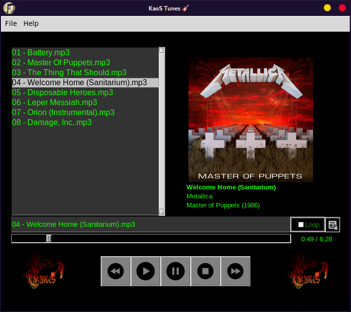

# Kaos Tunes v2.0

Kaos Tunes is a simple, privacy-respecting music player written in Python. It offers a clean, minimalist graphical user interface (GUI) built with Tkinter, and supports a variety of audio formats. The player focuses on delivering a distraction-free, telemetry-free, and DRM-free music playback experience.

---

## Features

- **Privacy-Focused**  
  No telemetry, no tracking, no communication with third parties. Your music plays without hidden data collection.

- **DRM-Free Playback**  
  Play your music freely without restrictions or license checks.

- **Cross-Platform GUI**  
  Built using Python's Tkinter library, Kaos Tunes works on Windows, Linux, and macOS (with Python and dependencies installed).

- **Supports Common Audio Formats**  
  Playback support for MP3, WAV, FLAC, OGG, and more, powered by [Pygame](https://www.pygame.org/).

- **Metadata Extraction**  
  Reads song metadata (title, artist, album, year) using [Mutagen](https://mutagen.readthedocs.io/).

- **Album Artwork Display**  
  Extracts and displays embedded album art or folder-based album art (e.g., `folder.jpg`), with a fallback logo.

- **Playlist Management**  
  Load single music files or JSON-based playlists, save playlists, clear the queue, shuffle, and remove individual songs.

- **Playback Controls**  
  Play, pause, resume, stop, skip forward, skip backward, and loop the playlist.

- **Responsive UI**  
  Uses threading to keep the interface responsive during playback.

- **User-Friendly Interface**  
  Intuitive controls and visual feedback including currently playing song title and album art.

---

## Screenshots



---

## Installation

### Requirements

- Python 3.6 or later  
- The following Python packages (install via pip):

  - `Pillow` (for image handling)  
  - `pygame` (for audio playback)  
  - `mutagen` (for metadata extraction)

You can install dependencies using:

```bash
pip install Pillow pygame mutagen
